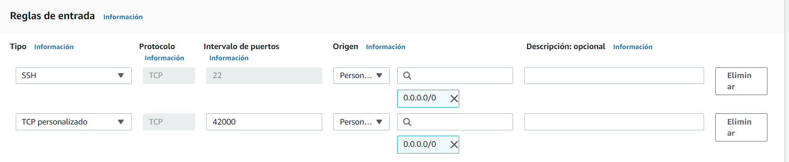

# Implementación de una arquitectura distribuida

Este proyecto consiste en la implementación de una arquitectura distribuida, basada en
la simple búsqueda de primos, con el objetivo de aumentar el uso de CPU,
y crear escalamiento vertical en AWS.

[](https://www.codacy.com/gh/alejovasquero/AREP---ScalableApp/dashboard?utm_source=github.com&amp;utm_medium=referral&amp;utm_content=alejovasquero/AREP---ScalableApp&amp;utm_campaign=Badge_Grade)
[](https://circleci.com/gh/alejovasquero/AREP---ScalableApp)

## Empezando

### Conexión a AWS

Estas instrucciones muestran como compilar el proyecto, instalarlo en AWS, y
comprobar la creación de instancias por medio de auto escalado en AWS.

* En este ejercicio vamos a usar una imagen ya creada del proyecto en Docker Hub,
por lo que la descarga de los ejecutables debería ser en una simple línea.
* Primeros vamos a conectarnos a nuestra máquina en AWS.

```console
ssh -i <KEY> <USER>@<DIRECCIÓN>
```

* En nuestro caso de estudio

```console
ssh -i "AREP-FINAL.pem" ec2-user@ec2-3-88-27-149.compute-1.amazonaws.com
```

### Configuración de docker

* Vamos a instalar docker en la máquina de AWS.

```console
sudo yum update -y
sudo yum install docker
```

* Para que docker corra los contenedores al iniciar la máquina, vamos
a usar ***systemctl***

```console
sudo systemctl enable docker
sudo usermod -a -G docker ec2-user
```

### Descarga de la imagen

* Ahora, con docker configurado, vamos a correr la aplicación y configurar el puerto.

```
sudo docker run --restart=always -d -p 42000:6000 --name myapp alejovasquero/scalableapp
```

* Configuramos el puerto 42000 para que esté expuesto a la red.



* Comprobamos el funcionamiento por medio de curl.


### Creando una imagen de la máquina

* Desde la consola de AWS, creamos una imagen, seleccionando nuestra máquina EC2.


* Le ponemos un nombre a nuestra imagen.


* Ahora vamos a crear una nueva configuración de lanzamiento desde la consola de AWS.


 

* Ponemos nombre a nuestra configuración, y elegimos la imagen de la máquina seleccionada.

 

* Escogemos el grupo de seguridad que configuramos para recibir solicitudes de entrada.


* Usamos las llaves que creamos de inicio y creamos la configuración.


### Creando un grupo de autoescalamiento.

* Desde la cnsola de autoescalamiento, vamos a crear un grupo con la configuración creada.


* Verificamos los datos del grupo, como el AMI, grupo de seguridad y nombre.


* Configuramos las redes sobre las que AWS va a crear las nuevas instancias. 


* Seleccionamos la cantidad de instancias que queremos crear dado un umbral de uso de CPU.


* Ahora podemos crear la regla de auto scaling.

### Comprobación

* Vamos a mandar una solicitud que pedirá bastante uso de CPU. Esta solicitud busca números primos 
por fuerza bruta en un intervalo dado, por medio de concurrencia.


* Desde AWS, podemos ver el incremento en el uso de CPU.


* Además podemos ver la creación automática de más instancias.


### Prerrequisitos 

Para instalar y correr exitosamente este proyecto necesitamos:
* **Java**
* **Maven**
* **Git**
* **Docker**

### Instalación

Primeramente vamos a descargar el repositorio en nuestra máquina local, y en la carpeta de 
nuestra preferencia. En consola vamos a digitar el siguiente comando para clonar el repositorio.

```console
git clone https://github.com/alejovasquero/AREP---ScalableApp
```

Entremos a el directorio del proyecto

```console
cd AREP---ScalableApp
```

Debemos compilar el proyecto, que contiene las clases necesarias para poder correr nuestro
proyecto. Por medio de maven vamos a crear todos los compilables **.class**. Desde consola, y ubicados en la carpeta donde se encuentra
nuestra configuración de maven.

```console
mvn package
```

Ahora que nuestras clases etan compiladas vamos a ejecutar la clase principal para
ver el código en acción : )

## Pasos de trabajo

## Construido con

* [Maven](https://maven.apache.org/) - Manejo de dependencias
* [Git](https://git-scm.com/) - Control de versiones
* [Java](https://www.java.com/es/) - Lenguaje de programación
* [Spark](http://sparkjava.com/) - Framework de desarrollo web
* [Docker](https://www.docker.com/) - Contenedores ligeros

## Autores

* **David Alejandro Vasquez Carreño** - *Trabajo inicial* - [alejovasquero](https://github.com/alejovasquero)

## Licencia

Este proyecto está licenciado bajo la licencia del MIT - Vea el [LICENSE](LICENSE) para más detalles

## Reconocimientos

* Daniel Benavides